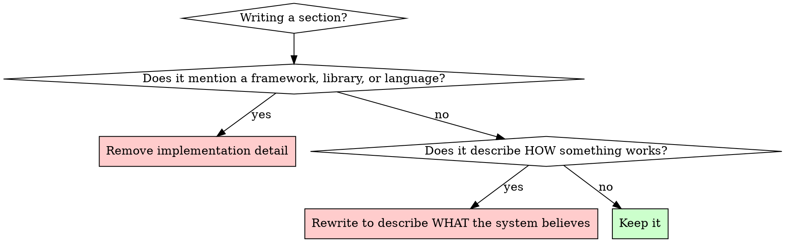
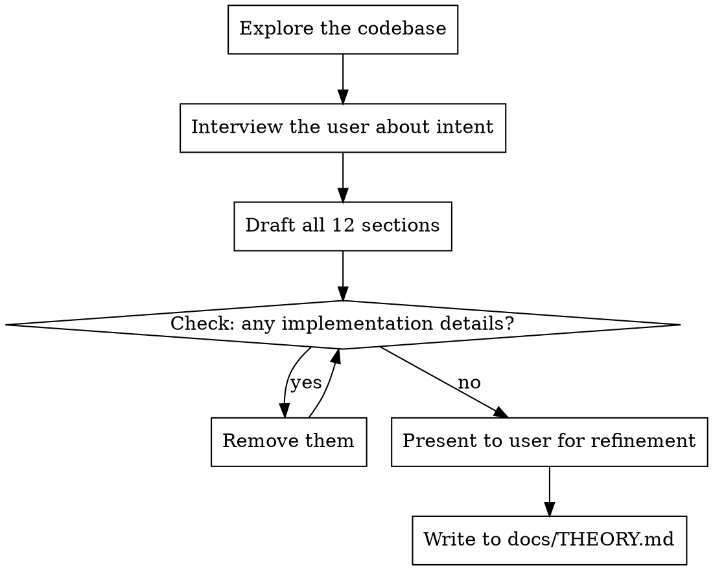

# Theorize

## Overview

Generate or update a `docs/THEORY.md` that preserves the **conceptual identity** of a project — what it is, why it exists, how it sees the world, what alternatives were considered, and what would damage its coherence over time.

Based on Peter Naur's *Programming as Theory Building*: the essential system is not the code, but the understanding held by the people building it. THEORY.md preserves that understanding.

## When to Use

- Starting a new project and want to capture its identity
- A project has developed its own philosophy and needs it documented
- The project has evolved and the theory needs updating
- Someone asks "what kind of thing is this system?"

**Do NOT confuse with:** README (onboarding), architecture docs (implementation), ADRs (decisions), specs (requirements). Those explain the implementation. THEORY.md explains the conceptual identity.

## The Iron Rule

**THEORY.md is conceptual, not technical.**

The document must survive rewrites, language migrations, infrastructure changes, UI redesigns, and architectural evolution. If the implementation changes completely, the theory should still largely hold.



## Required Structure

Every THEORY.md must have these 12 sections. Do not skip sections. Do not reorder. Do not merge.

Sections 1–6 describe the theory: what the system is, why, and what alternatives were considered.

Sections 7–12 form the **Constitutional Layer**: they translate the theory into durable constraints that preserve conceptual integrity over time. A useful mental model: Theory explains why. Constitution preserves what. Architecture determines how. Implementation delivers it.

### 1. Identity

Short, direct statement of what the system fundamentally *is*. One to three sentences max.

> "Ludus is a behavioral conditioning system for AI-assisted software workflows."

Ask: What kind of thing is this? What role does it play? What category of problem does it solve?

### 2. Why It Exists

The failure, tension, or opportunity that created the project. Why the world needed this to exist.

Ask: What problem created this? What existing solutions were insufficient? What operational pain triggered it?

### 3. Core Theory

The worldview embodied by the system. This is the conceptual heart. It should feel philosophical.

Ask: What does this system believe is important? What assumptions does it reject? What tradeoffs does it intentionally make?

### 4. Relationship To The World

How the system maps onto real-world activity. What human or organizational behavior does it model, support, or augment? Software does not exist in isolation — every system exists in relationship to people, organizations, workflows, or operational realities.

Ask: What real-world process does this support? What operational reality does it mirror? What human behavior does it augment?

### 5. Central Metaphors

The organizing metaphors and vocabulary of the system. Metaphors shape mental models, workflows, expectations, architecture, and culture.

Ask: What metaphors organize this system? What vocabulary should contributors use? What conceptual language reflects the philosophy?

### 6. Theories Considered

Important alternative theories that were seriously considered and intentionally not adopted. This preserves one of the most valuable and most easily lost forms of knowledge: not what was built, but what could have been built and why it wasn't.

Each entry should include: the alternative theory, its advantages, why it was not chosen, and what assumptions would need to change for it to become preferable.

Ask: What alternative approaches were seriously evaluated? Why were they attractive? Why were they rejected? Under what conditions might they become correct?

### 7. Responsibilities

What responsibilities belong to this system. What does it own? What obligations does it accept? Responsibilities should reinforce the theory.

Ask: What does this system own? What obligations does it accept? What naturally belongs here?

### 8. Boundaries

What responsibilities do NOT belong here. Boundaries are often more important than responsibilities. Many systems decay because they absorb neighboring concerns until their identity becomes unclear.

Ask: What neighboring concerns are intentionally excluded? What should be delegated elsewhere? What misconceptions are likely?

### 9. Operational Invariants

Truths that must remain stable over time. Not implementation details — conceptual constraints.

Ask: What must always remain true? What principles are non-negotiable? What would indicate conceptual corruption?

### 10. Natural Extensions

What kinds of growth fit naturally. Helps future maintainers understand what belongs here. Natural extensions should make the system more itself.

Ask: What adjacent ideas fit naturally? What future expansions would deepen the system rather than dilute it?

### 11. Theory Violations

Patterns that indicate conceptual decay. **This is one of the most important sections.** It protects against drift.

Ask: What changes would technically work but conceptually damage the system? What shortcuts undermine the theory? What anti-patterns should future maintainers watch for?

### 12. Signals Of Health

What healthy evolution looks like. How can you tell the theory is still alive?

Ask: How can we tell conceptual integrity is preserved? What signs suggest the project is still coherent? What indicates drift?

## Output Metadata

Every generated THEORY.md must include the following HTML comment block at the very top of the file, before the title:

```markdown
<!-- THEORY.md — Generated with guide v2026-06-15 -->
<!-- AI Trigger: Consult this document when evaluating architectural decisions, -->
<!-- feature proposals, or whether a change belongs in this project. Use the -->
<!-- theory, boundaries, and constitutional constraints to assess fit. -->
```

When updating an existing THEORY.md, update the guide version to the current guide version (`2026-06-15`). The version tracks which edition of the THEORY.md Guide was used, allowing future updates when the guide evolves.

## Creating a New THEORY.md



1. **Explore** — read the project's README, CLAUDE.md, key source files, and any existing design docs to understand what the system does
2. **Interview** — ask the user probing questions about identity, worldview, and boundaries. Don't assume you can infer the theory from code alone. The theory lives in people's heads.
3. **Draft** — write all 12 sections following the structure above. Include the output metadata comment block at the top. Keep each section concise and conceptual.
4. **Scrub** — review every sentence. Remove any mention of specific technologies, frameworks, libraries, data models, or implementation patterns. If a technology is essential to the identity (e.g., "Elixir library"), mention it only in the Identity section.
5. **Present** — show the draft to the user. The theory must reflect *their* understanding, not yours.
6. **Write** — save to `docs/THEORY.md`

## Updating an Existing THEORY.md

When updating, do NOT just append new sections or patch individual sentences. Theory evolution requires holistic reconsideration.

1. **Read** the existing THEORY.md completely
2. **Understand the change** — what has evolved in the project's understanding?
3. **Ask**: Does this change the Identity? The Core Theory? The boundaries?
4. **Revise holistically** — update every section that the change affects. A change to Core Theory likely affects Operational Invariants, Theory Violations, and Signals of Health too.
5. **Preserve continuity** — the updated theory should feel like a natural evolution, not a bolt-on. If the change fundamentally contradicts the existing theory, say so explicitly and explain the pivot.
6. **Update the guide version** in the output metadata comment to the current guide version.

### Theory Evolution Principles

Theory is not immutable. A healthy project may evolve its theory as understanding deepens. But theory changes should be deliberate, visible, reviewed, and documented.

When theory changes, architecture may change. When architecture changes, theory should not automatically change.

A major theory change may indicate a product pivot, a subsystem extraction, a new understanding of the problem, or the discovery that the original theory was incomplete.

### Review Questions

When evaluating proposed changes, run through these questions:

- Does this belong here?
- Does this reinforce the theory?
- Does this align with the chosen theory rather than a rejected one?
- Does this violate a boundary?
- Does this create conceptual overlap?
- Are we still the same kind of thing afterward?
- Would future maintainers recognize the system from this change?
- Are we solving the same problem more effectively, or a different problem entirely?

## Common Mistakes

| Mistake | Fix |
|---------|-----|
| Writing an architecture doc | Remove all implementation details. No frameworks, no data models, no API shapes. |
| Free-form essay without structure | Use the 12 required sections. Every one. In order. |
| Skipping "Theory Violations" | This section is what prevents drift. It is not optional. |
| Skipping "Central Metaphors" | Metaphors shape how people think about the system. Make them explicit. |
| Skipping "Theories Considered" | Preserving rejected alternatives prevents rediscovery and re-argument. Without this, previously rejected ideas resurface because the reasoning was lost. |
| Including technology justifications | "We chose X because..." belongs in an ADR, not THEORY.md. |
| Making Identity too long | Identity is 1-3 sentences. If you need more, you're explaining, not identifying. |
| Appending to theory instead of revising | When updating, reconsider holistically. Don't just add a section at the bottom. |
| Leaking technology into non-Identity sections | Even when the project IS a technology-specific library, name the technology only in Identity. Everywhere else, describe concepts abstractly. "Process-local context" → "execution-unit-local context." "Supervision tree propagation" → "hierarchical context propagation." If a sentence wouldn't make sense after a language migration, rewrite it. |
| Missing guide version comment | Always include the output metadata comment at the top. It tracks guide version and triggers AI consultation. |

## Quick Reference

| Section | Purpose | Length |
|---------|---------|--------|
| Identity | What it IS | 1-3 sentences |
| Why It Exists | The problem that created it | 1-2 paragraphs |
| Core Theory | Worldview and beliefs | 1-3 paragraphs |
| Relationship To The World | Real-world mapping | 1-2 paragraphs |
| Central Metaphors | Organizing language | Bullets with explanation |
| Theories Considered | Rejected alternatives and why | Structured entries |
| *— Constitutional Layer —* | *Sections 7-12 preserve the theory as durable constraints* | |
| Responsibilities | What the system owns | Bullet list |
| Boundaries | What does NOT belong here | Bullet list |
| Operational Invariants | Non-negotiable truths | Bullet list |
| Natural Extensions | What growth fits | Bullet list |
| Theory Violations | Anti-patterns for drift | Bullet list with explanation |
| Signals Of Health | How to detect coherence | Bullet list |
